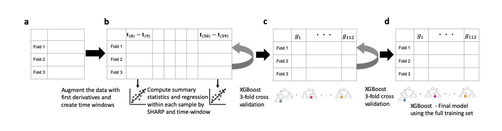
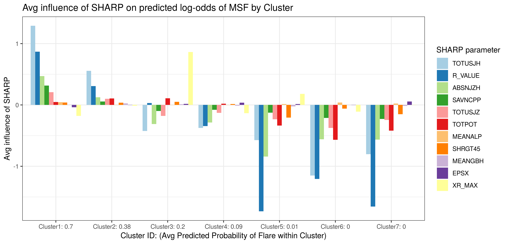

# solar_flare

This is the repository for the submission of the PSUBS team to the [IEEE BigData 2019 Big Data Cup](http://dmlab.cs.gsu.edu/bigdata19/flare-comp/) "Solar Flare Prediction from Time Series of Solar Magnetic Field Parameters" challenge.

Figure 1: Workflow of the modelling: **(a)** The original dataset is augmented with first
 derivatives and separated in 6 time windows of 2 hours. **(b)** In the augmented
 dataset, summary statistics are computed within sample for each SHARP in each time
 window to create a matrix of features derived from the original set of covariates. 
 Important predictors are selected with XGBoost using a 3-folds cross validation.
 **(c)** The final dataset of 112 predictors is used again in 3-folds cross validation
 to select optimal tuning parameters for the final model. **(d)** The final model is
 computed by runing XGBoost a third time on the full training set and is then applied
 to the test set for prediction.

- step1_handle_missing.R --imputation for missing data 
- step2_make_solar_data.R --create window-based features  
- step3_big_xgb_brute_force.R --fit variable selection model
- step4_xgb_slim_tune.R --tune final model with 112 predictors
- step4_xgb_slim_tune.sh 
- step5_fit_and_submit.R --submit model
- make_sumdt_window_func.R --utility functions including feature calculation by window
- shap_plot_funcs.R --plotting functions
